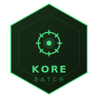

<p align="center">
  
</p>

# KORE BATCH

> Socle Spring Batch extrait de plusieurs années de production réelle.
> Conçu entre 2018 et 2021 sur des projets à fort volume de données, remis à niveau en 2025.
> Pas un tutoriel, une base de travail éprouvée.

---

## Le nom

**K** comme Kouba. **ORE** comme core, le socle.

Ce n'est pas un acronyme inventé après coup. Le nom est venu naturellement : une identité derrière, une philosophie devant. Construire des fondations solides avant de construire des fonctionnalités. Penser architecture avant code.

**KORE** est un écosystème de socles Java open source, destiné à la communauté.

---

## L'écosystème KORE

Chaque brique suit la même logique : extraite ou construite sur une base réelle, documentée, testée, utile.

| Brique | Description | Statut |
|---|---|---|
| [kore-hexagonal](https://github.com/alak8ba/kore-hexagonal) | Architecture hexagonale • 1,5 an de production réelle • 658 commits | Disponible |
| **[kore-batch](https://github.com/alak8ba/kore-batch)** | Traitement batch • plusieurs années de production • fort volume de données | Disponible |
| [kore-genie](https://github.com/alak8ba/kore-genie) | Socle IA privée & RAG • déploiement on-premise • zéro donnée sortante | Disponible |
| [kore-n8n](https://github.com/alak8ba/kore-n8n) | Automatisation self-hosted • n8n • Docker • Traefik • Let's Encrypt | Disponible |
| kore-stream | Traitement de flux temps réel | Prévu |
| kore-react | Composants frontend réutilisables | Prévu |

---

## Pourquoi ce projet existe

Les projets batch ont tous les mêmes besoins transverses : lancer un job depuis la ligne de commande, gérer les codes retour, agréger les résultats des partitions parallèles, distinguer les erreurs techniques des erreurs fonctionnelles, produire une synthèse d'exécution.

Ce socle extrait ces patterns une fois pour toutes. Le projet qui l'utilise n'écrit que ce qui lui est propre : son reader, son processor, son writer, sa synthèse métier.

---

## Stack

| Couche | Technologie |
|---|---|
| Langage | Java 21 |
| Framework | Spring Boot 3.3 |
| Batch | Spring Batch 5 |
| Base de données | PostgreSQL |
| Migrations | Liquibase |
| Observabilité | Micrometer + Prometheus |
| Logging | Logstash Logback (JSON structuré) |
| Tests | JUnit 5 + Testcontainers |
| CI/CD | GitHub Actions + GitHub Packages |

---

## Architecture

Le socle fournit l'infrastructure commune. Le projet métier n'implémente que les couches fonctionnelles.

```
+----------------------------------------------------------+
|                    kore-batch (socle)                    |
|                                                          |
|   BatchLauncher --> JobLauncher --> Job                  |
|                                      |                   |
|                              PartitionStep               |
|                           +----+----+                    |
|                      Worker  ...  Worker  (N threads)    |
|                           +----+----+                    |
|                       AbstractBatchAggregator            |
|                                |                         |
|                         ISynthese (résultat global)      |
+----------------------------------------------------------+
                               ^
                               | extends / implements
+----------------------------------------------------------+
|                 kore-batch-sample (métier)               |
|                                                          |
|   SampleBatchApplication --> BatchConfiguration          |
|   CommandeItemReader                                     |
|   CommandeItemProcessor  --> FunctionalException         |
|   CommandeItemWriter                                     |
|   CommandeAggregator     --> CommandeSyntheseDto         |
+----------------------------------------------------------+
```

---

## Structure du projet

```
kore-batch/
├── kore-batch/              # Socle - publié sur GitHub Packages
│   └── src/main/java/dev/kore/batch/core/
│       ├── BatchLauncher.java
│       ├── config/          # ThreadPool, configuration commune
│       ├── dto/             # ISynthese, SyntheseDto
│       ├── error/           # FunctionalException, TechnicalException
│       ├── aggregator/      # AbstractBatchAggregator<T>
│       └── listener/        # BatchJobExecutionListener
│
├── kore-batch-sample/       # Exemple d'utilisation complet
│   ├── src/main/java/dev/kore/batch/sample/
│   └── src/main/resources/
│       ├── application.yml
│       ├── application-dev.yml
│       ├── application-prod.yml
│       └── db/changelog/    # Migrations Liquibase
│
├── deploy/                  # Scripts Debian (prod)
├── docker-compose.dev.yml   # PostgreSQL local
├── .github/workflows/       # CI/CD GitHub Actions
└── docs/                    # Conception technique et fonctionnelle
```

---

## Démarrage rapide

### Prérequis

- Java 21+
- Docker & Docker Compose
- Maven 3.9+

### Lancer le sample en local

```bash
git clone https://github.com/alak8ba/kore-batch.git
cd kore-batch

# Démarrer PostgreSQL
docker compose -f docker-compose.dev.yml up -d

# Builder l'ensemble du projet (socle + sample)
mvn clean install -DskipTests

# Lancer le sample
mvn spring-boot:run -pl kore-batch-sample \
  -Dspring-boot.run.profiles=dev \
  -Dspring-boot.run.arguments="--inputFile=/data/commandes.csv"
```

### Lancer les tests

```bash
mvn test -pl kore-batch-sample                              # Tests unitaires
mvn failsafe:integration-test -pl kore-batch-sample        # Tests d'intégration (Testcontainers)
```

---

## Utiliser le socle dans votre projet

Ajouter la dépendance depuis GitHub Packages :

```xml
<dependency>
    <groupId>dev.kore.batch</groupId>
    <artifactId>kore-batch</artifactId>
    <version>1.0.0</version>
</dependency>
```

Puis suivre le guide dans [docs/03-design/utilisation-socle.md](docs/03-design/utilisation-socle.md).

---

## CI/CD

GitHub Actions s'exécute à chaque push sur `main` :

1. Publication du socle `kore-batch` sur GitHub Packages
2. Build et tests unitaires du sample
3. Tests d'intégration (Testcontainers, vrai PostgreSQL)

---

## Documentation

[docs/](docs/README.md)

---

## Licence

Apache 2.0 - voir [LICENSE](LICENSE).
