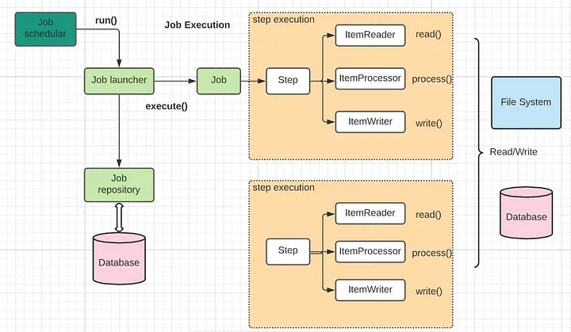

# Architecture du socle

## Modèle d'exécution Spring Batch

Le diagramme ci-dessous illustre le modèle d'exécution standard de Spring Batch, tel qu'implémenté dans ce socle.



**Lecture du diagramme :**

- Le **Job Scheduler** (cron, Control-M, CI) déclenche `run()` sur le **Job Launcher**
- Le **Job Launcher** exécute le **Job** et persiste les métadonnées dans le **Job Repository** (PostgreSQL)
- Chaque **Step** orchestre un cycle `read() -> process() -> write()` répété par chunk
- Plusieurs steps peuvent s'enchaîner : ici deux steps parallèles illustrent le partitionnement
- Le **File System** et la **Database** sont les sources/destinations typiques

Dans `kore-batch`, le partitionnement parallèle découpe automatiquement le traitement en N workers qui exécutent chacun ce cycle indépendamment, avant agrégation par `AbstractBatchAggregator`.

---

## Vue d'ensemble

```
+--------------------------------------------------------------+
|                      kore-batch (socle)                      |
|                                                              |
|  +----------------+    +--------------+    +---------------+ |
|  | BatchLauncher  |-->>|  JobLauncher |-->>|      Job      | |
|  |  (abstract)    |    |   (Spring)   |    |   (Spring)    | |
|  +----------------+    +--------------+    +-------+-------+ |
|                                                    |         |
|                                           +--------v-------+ |
|                                           |  PartitionStep | |
|                                           +--------+-------+ |
|                                    +-------+--------+------+ |
|                               Worker 1   ...   Worker N     ||
|                               (Reader)         (Reader)     ||
|                               (Processor)      (Processor)  ||
|                               (Writer)         (Writer)     ||
|                                    +-------+--------+------+ |
|                                    +-------v--------+------+ |
|                                    |  AbstractBatchAggregator||
|                                    |   merge(global, part.) ||
|                                    +-------+--------+------+ |
|                                    +-------v--------+------+ |
|                                    |    ISynthese           ||
|                                    |  (résultat global)     ||
|                                    +------------------------+|
+--------------------------------------------------------------+
```

## Composants du socle

### BatchLauncher

Point d'entrée abstrait. Implémente `CommandLineRunner` Spring Boot.

Responsabilités :
- Construire les `JobParameters` (timestamp + paramètres métier)
- Lancer le job via `JobLauncher`
- Résoudre le code retour depuis la synthèse d'exécution
- Appeler `System.exit()` avec le bon code

Codes retour :
| Code | Signification |
|---|---|
| `0` | Succès |
| `-1` | Erreur technique |
| `1` | Erreurs fonctionnelles bloquantes (désactivé par défaut) |

Le projet métier surcharge `addJobParameters()` pour injecter ses propres paramètres.

### AbstractBatchAggregator\<T\>

Agrège les synthèses de chaque partition en une synthèse globale.

Utilise un `Supplier<T>` (lambda) pour instancier la synthèse : remplace l'ancien `clazz.newInstance()` supprimé en Java 17+.

Le projet métier étend cette classe et implémente `merge(global, partition)`.

### ISynthese / SyntheseDto

Contrat de la synthèse d'exécution. Stockée dans le `JobExecutionContext` sous la clé `"synthese"`.

Compteurs : `nbOK`, `nbKO`, `nbDoublons`, `nbErreursTechniques`, `nbErreursFonctionnelles`.

Le projet métier étend `SyntheseDto` pour ajouter ses données métier.

### FunctionalException / TechnicalException

- `FunctionalException` (checked) : erreur métier. Le processor la catch, incrémente les compteurs, continue.
- `TechnicalException` (unchecked) : erreur infrastructure. Remonte jusqu'au `BatchLauncher`, code retour `-1`.

### BatchJobExecutionListener

Log structuré du début et de la fin du job avec durée et synthèse complète.

### BatchHealthAggregator

Verifie toutes les dependances avant le lancement du job.
Collecte automatiquement tous les beans `BatchHealthIndicator` declares dans le contexte Spring.

Indicateurs fournis par le socle :
- `DatabaseHealthIndicator` : verifie que la base de donnees est accessible

Indicateurs a ajouter par le projet metier :
- Etendre `AbstractWSHealthIndicator` pour chaque service externe a verifier

Si un indicateur est KO, le batch s'arrete avant meme de lancer le job (code retour -1).

### InputFileValidator

Valide les `JobParameters` avant le lancement du job.
Verifie que le parametre `inputFile` est present, que le fichier existe et est lisible.

```java
new JobBuilder("monJob", jobRepository)
    .validator(new InputFileValidator())
    .start(partitionStep)
    .build();
```

### CoreBatchConfiguration

Fournit le `ThreadPoolTaskExecutor` pour le partitionnement.
Taille du pool configurable via `batch.partitioning.pool-size` (defaut : 4).
Taille du chunk configurable via `batch.chunk-size` (defaut : 10).

## Changements Spring Batch 5 vs 4

| Spring Batch 4 | Spring Batch 5 |
|---|---|
| `JobBuilderFactory` | `new JobBuilder("nom", jobRepository)` |
| `StepBuilderFactory` | `new StepBuilder("nom", jobRepository)` |
| `@EnableBatchProcessing` obligatoire | Auto-configuré par Spring Boot 3 |
| `.chunk(10)` | `.chunk(10, transactionManager)` |
| `clazz.newInstance()` | `Supplier<T>` |
